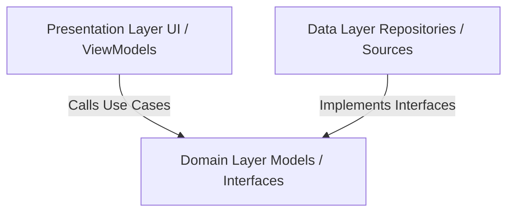

# Sync360 Architecture Guidelines

Sync360 follows a **Feature-based Clean Architecture** designed specifically for **Kotlin Multiplatform (KMP)** and **Compose Multiplatform (CMP)** projects. This standard ensures maximum codebase separation, absolute testability, strict dependency flows, and zero "god files".

All future features, refactorings, and additions to this repository **must** strictly conform to the specifications documented below.

---

## 📂 Core Package Directory Structure

All shared business, data, and presentation code lives under `shared/src/commonMain/kotlin/com/liftley/sync360/`. The codebase is structured into two primary root directories:

1. **`core/`**: General-purpose utility packages, database setups, layout design tokens, and shared network classes that are not restricted to a single user-facing feature.
2. **`features/`**: Highly cohesive, feature-centric sub-directories containing the presentation, domain, and data layers of distinct capabilities.

```
com/liftley/sync360/
│
├── core/
│   ├── designsystem/          # Themes, harmonious color palettes, custom dividers, fonts
│   ├── network/               # Core network clients (Ktor), socket protocols, serializers
│   └── database/              # Room KMP database configurations (Future Phase 3)
│
├── features/
│   ├── sync/                  # Connection sync feature area
│   │   ├── presentation/      # UI Composables, custom card sub-components, ViewModels/StateHolders
│   │   ├── domain/            # Pure business logic, Repository interfaces, Interactors/Use Cases
│   │   └── data/              # Socket connections, local repository implementations, platform drivers
│   │
│   └── history/               # Synced ledger log area
│       ├── presentation/      # Log views, clipboard list cards, copy-to-system components
│       ├── domain/            # Ledger models, clear history use-cases
│       └── data/              # Cache data layers
│
└── App.kt                     # Application entry router (orchestrates active feature viewports)
```

---

## 📐 Layers of Clean Architecture

Inside any given feature (e.g., `features/sync`), the code is divided into three distinct layers:

### 1. Presentation Layer (`presentation/`)
* **Role:** Drives what the user sees and interacts with.
* **Contents:** Composable layouts, preview components, design system wrappers, and ViewModels (state controllers).
* **Dependencies:** Can depend on the **Domain Layer** (for invoking use cases) and **Core Layer** (for styles and assets). It must **never** directly depend on the Data Layer.

### 2. Domain Layer (`domain/`)
* **Role:** Represents the pure business rules of the feature.
* **Contents:** Interface definitions (e.g., repository APIs), model definitions, and use cases (interactors).
* **Dependencies:** Must be a **pure Kotlin library layer**. It is decoupled from third-party framework layers, databases, or client-side UI systems. It has **zero dependencies** on `presentation` or `data` (Domain is the center core).

### 3. Data Layer (`data/`)
* **Role:** Handles caching, network socket pipelines, system resources, and clipboard bridges.
* **Contents:** Repository implementations, network API calls (Ktor), database DAO interactions, and system service hooks.
* **Dependencies:** Implements the interfaces defined in the **Domain Layer**. It can depend on `domain` and `core`.

---

## 🔗 The Dependency Flow Rule

> [!IMPORTANT]
> Dependency flows only move **inward** toward the Domain Layer. 
> * **Presentation** depends on **Domain**.
> * **Data** depends on **Domain** (to implement its repository interfaces).
> * **Domain** depends on **nothing** else within the feature.



---

## 🚫 Code Quality & Structuring Commandments

1. **No God Files:** Do not pack UI styling, networking, list structures, and button triggers into a single massive file (like the old `App.kt`). Monolithic classes are harder to parse, test, and maintain.
2. **Decompose UI Views:** Split large composite views into private or public subcomponent files (e.g. `ConnectionCard.kt`, `ActivityLogList.kt`, `HeaderStatusBadge.kt`) under their respective feature's `presentation` folder.
3. **Pure State Management:** UI Composables should be as stateless as possible. They should collect state from a ViewModel or model layer via `StateFlow` or Compose `State` variables and delegate user interactions upward via simple callback lambdas.
4. **Consistent Reference:** Any code change or addition MUST reference this `ARCHITECTURE.md` guideline file in its implementation plan to guarantee structural integrity is maintained.
