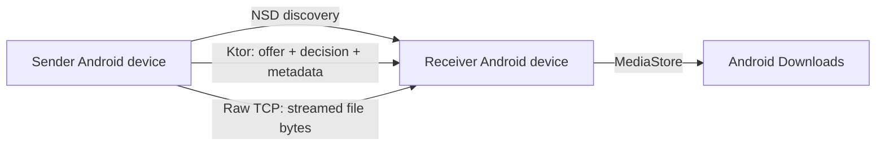

<div align="center">
  

  # Sync360

  **When the device is nearby, the path should be nearby too.**

  Direct text and file sharing between Android devices on the same local network.

  [](https://kotlinlang.org/)
  [](https://www.jetbrains.com/lp/compose-multiplatform/)
  [](https://ktor.io/)
  [](https://developer.android.com/)
  [](LICENSE)

  <video src="screenshots/hero-demo.mp4" controls preload="metadata" width="1080"></video>
  <br />
  <a href="screenshots/hero-demo.mp4"><strong>▶ Watch the current Android demo</strong></a>
  <br />
  <sub>Nearby discovery, receiver approval, and the current Android text/file transfer experience.</sub>
</div>

---

## Nearby sharing should not need a cloud detour

We have all done it: send a file to ourselves, wait for it to upload, open another device, wait for it to download, and save it again—even when both devices are in the same room.

Sync360 is for that nearby moment.

```text
open app -> find nearby device -> choose what to send -> receiver approves -> send directly
```

The current app discovers other Sync360 devices on the same local network and transfers content directly between them. The transfer path does not use an account, cloud storage, or a Sync360 backend. It depends on the local network and the two devices involved.

Chat apps and cloud drives are great when the other person is far away. Sync360 is being built for the simpler case: the destination is already nearby.

## Current status

Sync360 has a working Android-to-Android MVP for text and multiple-file transfer. It is still an active rebuild, not a production-ready release.

### Working now

- Discover nearby Android devices with Android NSD/mDNS.
- Advertise dynamic HTTP and file-transfer ports on the local network.
- Send a text offer and let the receiver accept or decline it.
- Transfer accepted text and copy it from the Receive screen.
- Select images, videos, documents, and multiple files.
- Show file metadata to the receiver before any file bytes are sent.
- Stream file bytes directly over raw TCP without loading an entire file into memory.
- Save received files into public Android Downloads through `MediaStore`.
- Delete the incomplete current file if its receive operation fails or is cancelled.
- Send files sequentially with a save acknowledgement after each file.
- Cancel a pending send or active file transfer on a best-effort basis.
- Show clear offer, transfer, success, failure, and cancelled states on the sender, with incoming, receiving, and received states on the receiver.

### Still needs work

- Authentication, encryption, transfer tokens, and session validation.
- File integrity hashes/checksums.
- Byte-level progress, percentage, speed, and time remaining.
- Rich receiver-side failure details and per-file results.
- More robust discovery, server, foreground/background, and cleanup lifecycles.
- Better IP address selection and IPv6 handling.
- Retry, pause/resume, and interrupted-transfer recovery.
- Automated transfer coverage and broader device/router testing.
- Rebuilt desktop and iOS discovery, transfer, and storage implementations.

The current progress UI counts completed files. That is understandable for small files, but a large file can look stuck while bytes are still moving. Byte-based progress is one of the next important UX improvements.

## How it works

Sync360 currently uses two small networking paths with different jobs:

- **Ktor HTTP is the control plane.** It carries text/file offers, receiver decisions, file metadata, and text payloads.
- **Raw TCP is the file data plane.** It streams the actual file bytes directly between Android devices.



Android NSD advertises `_sync360._tcp.` with a stable per-install device ID, device details, protocol version, an OS-assigned HTTP port, and a separate OS-assigned file-transfer port.

### Text path

```text
SendScreen
  -> SendScreenViewModel
  -> OutgoingRequestsController
  -> POST /sync360/text/offer
  -> receiver Accept/Decline
  -> POST /sync360/text/transfer
  -> ReceiveScreen shows the text
```

The sender shares a preview and character count first. The full text is posted only after the receiver accepts.

### File path

```text
Android file picker
  -> AndroidSelectedFileReader reads name, size, MIME type, and Uri
  -> POST /sync360/file/offer sends metadata
  -> receiver Accept/Decline
  -> AndroidFileTransferSender opens the Uri as an InputStream
  -> raw TCP streams each file in 64 KiB chunks
  -> AndroidDownloadsWriter writes to a pending MediaStore entry
  -> receiver acknowledges that the file was saved
```

One TCP socket is opened per file. Each socket begins with the file index and promised byte count, followed by exactly that many bytes. The receiver checks the index and size against the accepted offer before saving the file.

Files are sent sequentially. If a later file fails, files that were already completed stay in Downloads; only the incomplete current file is removed.

## A small performance note

In one manual Android-to-Android test over 5 GHz Wi-Fi, Sync360 transferred a roughly 575 MB file in about 24–26 seconds—around 22–24 MB/s.

That is one real test, not a guaranteed speed or a formal benchmark. Transfer speed depends on both devices, their storage, Wi-Fi radios, router or hotspot, signal quality, and other network traffic. Reproducible benchmarks across more hardware and networks are still future work.

## Architecture and project layout

The code intentionally follows a direct path:

```text
Compose screen -> ViewModel -> controller/service -> network or Android implementation
```

- `androidApp/` — Android application host, manifest, launcher assets, and app entry point.
- `shared/src/commonMain/` — shared Compose UI, ViewModels, screen/domain state, controllers, Ktor client/server, network contracts, and dependency injection.
- `shared/src/androidMain/` — Android NSD, file selection metadata, clipboard, local identity, raw TCP transfer, Downloads storage, and Android DI bindings.
- `desktopApp/` — Compose Desktop shell; the rebuilt networking flow is not active there yet.
- `iosApp/` — iOS shell; iOS targets are currently disabled in the shared Gradle configuration.

The project is Kotlin Multiplatform because shared product logic and UI are still part of the long-term direction. The implementation order is deliberately Android first.

## Tech stack

- Kotlin 2.3.21 and Kotlin Multiplatform
- Compose Multiplatform 1.11.1 with Material 3
- Android min SDK 33, compile/target SDK 37
- Ktor 3.5.1 client/server with CIO
- Koin 4.2.2
- Coroutines and `StateFlow`
- kotlinx.serialization JSON
- Android NSD/mDNS
- Java `Socket` / `ServerSocket` for file bytes
- Android `ContentResolver` and `MediaStore`
- Navigation 3
- Gradle 9.4.1 wrapper

## Getting started

### Requirements

- JDK 17
- A recent Android Studio version compatible with Android Gradle Plugin 9.2.x
- Android SDK Platform 37
- Two physical Android 13+ devices for real nearby-transfer testing
- A Wi-Fi network or hotspot that allows devices to communicate with each other

### Clone and open

```bash
git clone https://github.com/CodePandaaAI/Sync360.git
cd Sync360
```

Open the repository root in Android Studio and let Gradle sync finish.

### Build Android

Windows:

```powershell
./gradlew.bat :androidApp:assembleDebug
```

macOS/Linux:

```bash
./gradlew :androidApp:assembleDebug
```

There is no stable public release yet. For now, Sync360 should be built from source and treated as development software.

### Try the current flow

1. Install the same build on two Android devices.
2. Connect both devices to the same Wi-Fi network or hotspot.
3. Open Sync360 on both devices.
4. On the Send screen, wait for the other device to appear.
5. Choose Text or Files, select the nearby device, and send an offer.
6. Accept the offer on the receiving device.
7. Received files will be written to Android Downloads.

Some routers enable client isolation and block local device-to-device traffic. If discovery or transfer does not work, try another trusted Wi-Fi network or a phone hotspot.

## Security warning

Sync360 is **not secure for untrusted networks yet**.

The current Android MVP uses cleartext local HTTP and raw TCP. It does not authenticate the sender, encrypt content, bind file sockets to an approved session token, or verify file integrity with a cryptographic hash. Receiver approval exists in the UI, but it is not a complete security boundary.

Use the current app only for development and testing on private networks you control. Please report security-sensitive findings according to [SECURITY.md](SECURITY.md), not in a public issue.

## Roadmap

### Next: make the Android MVP trustworthy and informative

- Track bytes sent and received.
- Show total percentage, current speed, and clearer active-transfer feedback.
- Add integrity verification.
- Improve cancellation and failure reporting.
- Strengthen lifecycle behavior and local-network reliability.
- Design session validation, authentication, and encryption deliberately.

### Later: bring the same simple flow to more devices

- Desktop discovery, transfer, and storage.
- iOS investigation and implementation.
- Better cross-device UX and troubleshooting.
- Retry or resume support where the added protocol complexity is justified.

Sync360 is not trying to become a chat app, cloud-sync product, or permanent device manager. The product direction stays focused:

```text
find nearby -> approve -> send directly
```

## Why the rebuild is intentionally small

An older AI-generated sync implementation grew faster than it could be understood and maintained, so it was removed. The current version is being rebuilt manually, one complete path at a time.

That history shapes the code today:

- Prefer readable control flow over clever abstractions.
- Keep platform work out of composables.
- Keep HTTP DTOs at the network boundary.
- Stream large files instead of buffering them whole.
- Add architecture only when it clarifies a real responsibility.
- Describe unfinished work honestly.

This is a learning-driven project, but the goal is serious software that its maintainer can fully explain and own.

## Contributing

Focused feedback and contributions are welcome, especially around:

- Android NSD behavior across devices and routers
- local-network and socket reliability
- transfer security and threat modelling
- small UI/UX improvements
- focused tests for pure Kotlin logic
- clear documentation fixes

For large architecture or protocol changes, start with an issue so the user flow and tradeoffs can be discussed before implementation.

When reporting a networking bug, include the device models, Android versions, network setup, exact steps, expected result, actual result, and useful logs.

## License

Sync360 is available under the [Apache License 2.0](LICENSE).

## Maintainer

Created by **Romit Sharma**.

- [GitHub](https://github.com/CodePandaaAI)
- [LinkedIn](https://www.linkedin.com/in/romit-sharma-18b521329/)

If the idea clicks with you, star the repository, try the Android MVP, or share what broke. Real feedback is more useful than hype.
