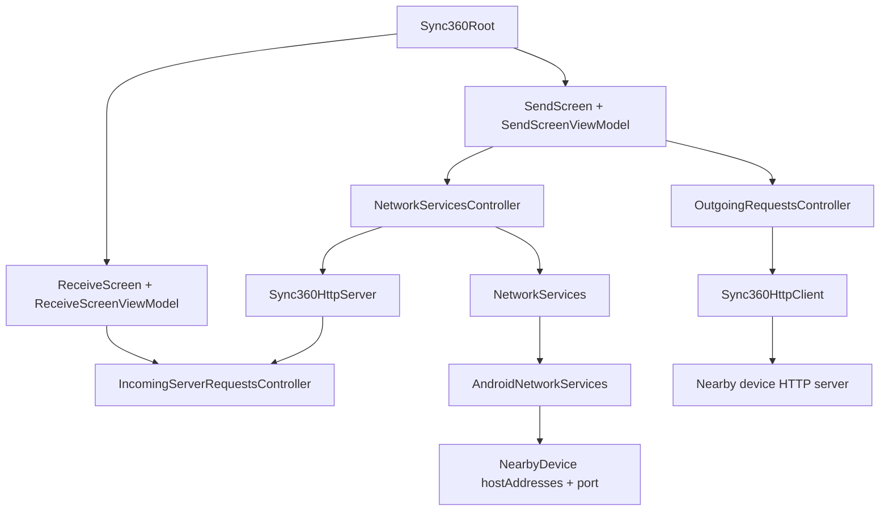

<div align="center">
  

  # Sync360

  **Nearby device sharing without sending everything through the cloud first.**

  Local-first Android device sharing, rebuilt from first principles with Kotlin Multiplatform.

  [](https://kotlinlang.org/)
  [](https://www.jetbrains.com/lp/compose-multiplatform/)
  [](https://ktor.io/)
  [](LICENSE)

  
  <sub>Current milestone: Android devices can discover each other locally, send a text offer, accept or decline it, transfer text, and copy the received text.</sub>
</div>

---

## The idea

Your devices are already next to each other. They are often on the same Wi-Fi. Sending something between them should not always mean opening a chat app, uploading it to a cloud drive, or sending it to yourself first.

Sync360 is an early-stage local network sharing app. The long-term goal is simple:

```text
same network -> discover nearby devices -> ask receiver -> send directly
```

The project is being rebuilt manually and in public after an older AI-generated implementation became too large to confidently own. This version is intentionally smaller, Android-first, and focused on understanding each networking step before adding more product surface.

## What Sync360 is

Sync360 is a Kotlin Multiplatform / Compose Multiplatform app for local nearby-device sharing.

It is being built around these principles:

- Local-first sharing on the same network.
- No cloud-first dependency for nearby devices.
- Clear receiver approval before sending.
- Kotlin-first architecture across shared code and platform implementations.
- Small, understandable slices instead of generated architecture.

## Current status

Sync360 is not a finished file transfer app yet. It is in an early Android-first rebuild phase.

### Working now

- Android app startup with Koin.
- Compose Multiplatform UI shell.
- Navigation 3 Send and Receive screens.
- Stable per-install local device UUID.
- Android NSD advertisement and nearby device discovery.
- Resolved nearby devices with `hostAddresses` and dynamic `port`.
- Embedded Ktor server inside the app.
- OS-assigned HTTP server port advertised through NSD.
- Ktor client/server request-response over the local network.
- Text offer route: `POST /sync360/text/offer`.
- Text transfer route: `POST /sync360/text/transfer`.
- Receiver-side Accept/Decline flow for incoming text offers.
- Text is transferred only after receiver approval.
- Receive screen can show received text and copy it.
- Send and Receive screens use ViewModel-owned screen state.

### Not implemented yet

- File picker.
- File transfer.
- Transfer progress.
- Android save-to-downloads/storage flow.
- Security/encryption/session validation.
- Desktop support for the rebuilt networking flow.
- iOS implementation.
- Production-ready error model.

## Demo and screenshots

The main demo GIF above shows the current Android text-transfer milestone.

Place visual assets in [`screenshots/`](screenshots/README.md). The folder includes recommended filenames and sizes.

## How the current Android flow works

```text
Device A starts a local Ktor server
Device A advertises itself with Android NSD
Device B discovers Device A
Device B reads Device A hostAddresses + port
Sender writes text
Sender sends a text offer to the receiver
Receiver accepts or declines
If accepted, sender transfers the text
Receiver shows the received text
Receiver can copy the text
```

This is the first real send flow. It proves that local discovery can lead to receiver approval and an actual payload transfer between two Android devices on the same network.

## Architecture



High-level module shape:

- `androidApp/` - Android app entry point and manifest.
- `desktopApp/` - JVM desktop app shell; present, but not active in the rebuilt flow yet.
- `shared/commonMain/` - shared UI, ViewModels, domain models, Koin module, Ktor client/server, request controllers, and DTOs.
- `shared/androidMain/` - Android NSD discovery, local identity, local device info, and clipboard implementation.

More detail: [docs/ARCHITECTURE.md](docs/ARCHITECTURE.md)

## Tech stack

- Kotlin 2.3.21
- Kotlin Multiplatform
- Compose Multiplatform 1.11.1
- Android application module
- JVM desktop module
- Koin 4.2.2
- Ktor 3.5.1 client/server with CIO
- kotlinx.serialization JSON
- Coroutines and StateFlow
- Android NSD / mDNS discovery
- Navigation 3
- Gradle 9.4.1 wrapper

## Getting started

### Prerequisites

- JDK 17
- Android Studio or IntelliJ IDEA with Kotlin support
- Android SDK Platform 37 installed
- Android SDK Build Tools 36.0.0 or newer
- Gradle is provided by the wrapper (`9.4.1`)
- At least one Android device or emulator for app launch
- Two physical Android devices on the same local network for real discovery and transfer testing

The project currently uses Android Gradle Plugin 9.2.1. Use a recent Android Studio version that supports AGP 9.2.x.

### Clone

```bash
git clone https://github.com/CodePandaaAI/Sync360.git
cd Sync360
```

### Open in IDE

Open the repository root in Android Studio or IntelliJ IDEA. Let Gradle sync finish.

### Build Android

Windows:

```powershell
./gradlew.bat :androidApp:assembleDebug
```

macOS/Linux:

```bash
./gradlew :androidApp:assembleDebug
```

### Desktop

The desktop module exists, but the current rebuilt networking flow is Android-first. You can inspect/run the shell with:

```bash
./gradlew :desktopApp:run
```

Desktop discovery and transfer behavior should be treated as future work unless the current code says otherwise.

## Roadmap

### Current Android milestone

- Android local discovery.
- Dynamic local HTTP server port advertisement.
- Text offer with receiver Accept/Decline.
- Direct text transfer after approval.
- Received text display and copy action.

### Near-term

- File selection UI.
- Selected file model.
- File offer request/response.
- File byte transfer.
- Progress states.
- Android save-to-downloads/storage handling.
- Better error states.
- Cleaner lifecycle around server/discovery start and stop.
- Better host address selection, including IPv4 preference and IPv6 formatting.

### Later

- Multiple files and mixed text/file bundles.
- Desktop support.
- Security/session validation.
- Transfer integrity checks.
- Optional transfer history.
- Clipboard-oriented flows, if they fit the product direction.
- iOS investigation.

See [docs/ROADMAP.md](docs/ROADMAP.md).

## Contributing

Sync360 is early. That makes feedback useful.

Good contributions right now:

- Android local-network testing notes.
- Ktor client/server suggestions.
- NSD reliability improvements.
- Clear naming and architecture feedback.
- Small bug fixes.
- Documentation improvements.

Please read [CONTRIBUTING.md](CONTRIBUTING.md) before opening a pull request. Large architecture changes should be discussed first.

## Community and feedback

If you try the project and something breaks, open an issue with:

- device model
- Android version
- network type
- what you expected
- what happened
- logs if available

Architecture discussions are welcome, especially around local networking, KMP boundaries, Ktor, Android NSD, and future file transfer design.

## Security

This project will eventually handle local network file transfer. Please do not report security-sensitive issues publicly if they expose a vulnerability. See [SECURITY.md](SECURITY.md).

## License

Apache License 2.0. See [LICENSE](LICENSE).

## Maintainer

Created by **Romit Sharma**.

- GitHub: https://github.com/CodePandaaAI
- LinkedIn: https://www.linkedin.com/in/romit-sharma-18b521329/

If this project sounds interesting, star it, follow the rebuild, or open a discussion.
