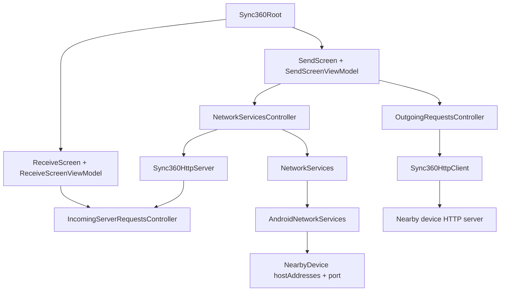

<div align="center">
  

  # Sync360

  **Send files across your own devices without the cloud getting involved.**

  Local-first device sharing, rebuilt from first principles with Kotlin Multiplatform.

  [](https://kotlinlang.org/)
  [](https://www.jetbrains.com/lp/compose-multiplatform/)
  [](https://ktor.io/)
  [](LICENSE)

  <!-- TODO: Add hero demo GIF here: screenshots/hero-demo.gif -->
  <br />
  <sub>Current milestone: Android devices can discover each other locally and exchange a simple Ktor request/response.</sub>
</div>

---

## The idea

Your devices are already next to each other. They are often on the same Wi-Fi. Sending a large file should not always mean uploading it to a chat app or cloud drive first.

Sync360 is an early-stage local network sharing app. The long-term goal is simple:

```text
same network -> discover nearby devices -> ask receiver -> send directly
```

The project is being rebuilt manually and in public after an older AI-generated implementation became too large to confidently own. This version is intentionally smaller, Android-first, and focused on understanding every networking step before adding more product surface.

## What Sync360 is

Sync360 is a Kotlin Multiplatform / Compose Multiplatform app for local peer-to-peer file and data sharing.

It is being built around these principles:

- Local-first sharing on the same network.
- No cloud-first dependency for nearby devices.
- Clear receiver approval before sending.
- Kotlin-first architecture across shared code and platform implementations.
- Small, understandable slices instead of generated architecture.

## Current status

Sync360 is not a finished file transfer app yet. It is in an early rebuild phase.

### Working now

- Android app startup with Koin.
- Compose Multiplatform UI shell.
- Navigation 3 Send and Receive screens.
- Stable per-install local device UUID.
- Android NSD advertisement and nearby device discovery.
- Resolved nearby devices with `hostAddresses` and dynamic `port`.
- Embedded Ktor server inside the app.
- OS-assigned HTTP server port advertised through NSD.
- Ktor client calling a discovered device.
- First local route: `GET /sync360/ping`.
- Experimental receiver-side Accept/Decline proof for incoming ping requests.

### Experimental

- Send screen request status UI.
- Receiver request state flow and navigation behavior.
- Naming and boundaries around network controllers.
- The current ping route is being used to learn request/response coordination; it is not the final send-offer protocol.

### Planned

- Real send-offer request and response DTOs.
- File picker and selected item list.
- Direct text snippet sending.
- File byte transfer.
- Transfer progress and result UI.
- Android storage/save handling.
- Desktop support for the rebuilt flow.
- Security/session validation after the simple flow works.

## Demo and screenshots

<!-- TODO: Add hero demo GIF here: screenshots/hero-demo.gif -->
<!-- TODO: Add Android screenshot here: screenshots/android-send.png -->
<!-- TODO: Add receiver approval screenshot here: screenshots/android-receive-request.png -->
<!-- TODO: Add architecture preview here: screenshots/architecture-preview.png -->
<!-- TODO: Add desktop screenshot later: screenshots/desktop-home.png -->

Place visual assets in [`screenshots/`](screenshots/README.md). The folder includes recommended filenames and sizes.

## How the current prototype works

```text
Device A starts a local Ktor server
Device A advertises itself with Android NSD
Device B discovers Device A
Device B reads Device A hostAddresses + port
Device B calls http://host:port/sync360/ping
Device A surfaces the request on Receive
User accepts or declines
Device A responds
Device B receives Accepted or Declined
```

This is the first control-plane milestone. It proves that local discovery can lead to an actual HTTP request and a structured response between two Android devices.

## Architecture



High-level module shape:

- `androidApp/` - Android app entry point and manifest.
- `desktopApp/` - JVM desktop app shell; present, but not active in the rebuilt flow yet.
- `shared/commonMain/` - shared UI, ViewModels, domain models, Koin module, Ktor client/server prototype.
- `shared/androidMain/` - Android NSD discovery and Android local identity implementation.

More detail: [docs/ARCHITECTURE.md](docs/ARCHITECTURE.md)

## Tech stack

- Kotlin 2.3.21
- Kotlin Multiplatform
- Compose Multiplatform 1.11.1
- Android application module
- JVM desktop module
- Koin 4.2.2
- Ktor 3.5.1 client/server with CIO
- kotlinx.serialization JSON
- Coroutines and StateFlow
- Android NSD / mDNS discovery
- Navigation 3
- Gradle 9.4.1 wrapper

## Getting started

### Prerequisites

- JDK 17
- Android Studio or IntelliJ IDEA with Kotlin support
- Android SDK installed
- At least one Android device or emulator for app launch
- Two physical Android devices on the same local network for real discovery testing

### Clone

```bash
git clone <your-repo-url>
cd Sync360
```

Replace `<your-repo-url>` after the repository is public.

### Open in IDE

Open the repository root in Android Studio or IntelliJ IDEA. Let Gradle sync finish.

### Build Android

Windows:

```powershell
./gradlew.bat :androidApp:assembleDebug
```

macOS/Linux:

```bash
./gradlew :androidApp:assembleDebug
```

### Desktop

The desktop module exists, but the current rebuilt networking flow is Android-first. You can inspect/run the shell with:

```bash
./gradlew :desktopApp:run
```

Desktop discovery and transfer behavior should be treated as future work unless the current code says otherwise.

## Roadmap

### MVP direction

- Android local discovery.
- Dynamic local HTTP server port advertisement.
- Simple request/response between two Android devices.
- Real send offer with receiver Accept/Decline.
- Direct text send.
- One-file transfer.

### Near-term

- File selection UI.
- Selected item list.
- Progress states.
- Better error states.
- Receiver result UI.
- Cleaner lifecycle around server/discovery start and stop.
- Better host address selection, including IPv4 preference and IPv6 formatting.

### Later

- Multiple files and mixed text/file bundles.
- Desktop support.
- Security/session validation.
- Transfer integrity checks.
- Optional transfer history.
- Clipboard-oriented flows, if they fit the product direction.
- iOS investigation.

See [docs/ROADMAP.md](docs/ROADMAP.md).

## Contributing

Sync360 is early. That makes feedback useful.

Good contributions right now:

- Android local-network testing notes.
- Ktor client/server suggestions.
- NSD reliability improvements.
- Clear naming and architecture feedback.
- Small bug fixes.
- Documentation improvements.

Please read [CONTRIBUTING.md](CONTRIBUTING.md) before opening a pull request. Large architecture changes should be discussed first.

## Community and feedback

If you try the project and something breaks, open an issue with:

- device model
- Android version
- network type
- what you expected
- what happened
- logs if available

Architecture discussions are welcome, especially around local networking, KMP boundaries, Ktor, Android NSD, and future file transfer design.

## Security

This project will eventually handle local network file transfer. Please do not report security-sensitive issues publicly if they expose a vulnerability. See [SECURITY.md](SECURITY.md).

## License

Apache License 2.0. See [LICENSE](LICENSE).

## Maintainer

Created by **Romit Sharma**.

- GitHub: TODO: add GitHub profile link
- LinkedIn: TODO: add LinkedIn profile link

If this project sounds interesting, star it, follow the rebuild, or open a discussion when the repository goes public.
