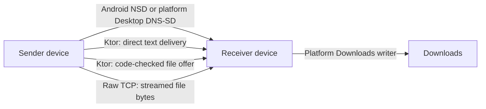

<div align="center">
  

  # Sync360

  **When the device is nearby, the path should be nearby too.**

  Direct text and file sharing between Android and Desktop devices on the same local network.

  [](https://kotlinlang.org/)
  [](https://www.jetbrains.com/lp/compose-multiplatform/)
  [](https://ktor.io/)
  [](https://developer.android.com/)
  [](LICENSE)

  ### Android → Android

  
  <sub>Nearby discovery and direct Android-to-Android text/file transfer.</sub>

  ### Desktop → Android

  
  <sub>1.51 GB transferred from Desktop to Android in 22.333 seconds in one manual test.</sub>
</div>

---

## Nearby sharing should not need a cloud detour

We have all done it: send a file to ourselves, wait for it to upload, open another device, wait for it to download, and save it again—even when both devices are in the same room.

Sync360 is for that nearby moment.

```text
open app -> find nearby device -> choose text or files -> send directly
```

The current app discovers other Sync360 devices on the same local network and transfers content directly between them. The transfer path does not use an account, cloud storage, or a Sync360 backend. It depends on the local network and the two devices involved.

Chat apps and cloud drives are great when the other person is far away. Sync360 is being built for the simpler case: the destination is already nearby.

## Current status

Sync360 has a working Android-to-Android MVP for text and multiple-file transfer. The Desktop/JVM app now uses the same shared flow, and Desktop-to-Android file transfer is working in manual testing. An initial iOS implementation is enabled in source and has opened successfully in a cloud simulator, but nearby discovery and transfer still need physical-device validation. It is still an active rebuild, not a production-ready release.

In an initial Windows 11 Ethernet test, the native Windows DNS-SD backend discovered the Android device quickly, removed it promptly after the Android app closed, appeared promptly on Android after Sync360 started, and disappeared from Android after the Desktop app closed. The Desktop discovery UI also left its initial loading state when the native browse operation started instead of continuing to show loading while resolved devices were already visible. These are manual observations from one setup, not broad Windows or laptop compatibility guarantees.

### Working now

- Discover nearby Android devices with Android NSD/mDNS.
- Advertise dynamic HTTP and file-transfer ports on the local network.
- Deliver text directly with one HTTP request when the receiver is idle.
- Enforce a 100,000-character text limit and show the sender name with Copy and Clear actions.
- Select images, videos, documents, and multiple files.
- Generate a temporary four-digit file receive code for each fresh application session and show the same code on both Send and Receive.
- Check the receive code and file metadata before any file bytes are sent.
- Stream file bytes directly over raw TCP without loading an entire file into memory.
- Save received files into public Android Downloads through `MediaStore`, preserving the extension when duplicate names are resolved.
- Delete the incomplete current file if its receive operation fails or is cancelled.
- Stream each accepted file batch continuously, then confirm the batch with one final receiver result.
- Cancel a pending send or active file transfer on a best-effort basis.
- Show batch-wide byte percentage while files are being sent and received.
- Show clear preparation, transfer, success, failure, and cancelled states on the sender, with receiving and received states on the receiver.
- Run the shared Send/Receive UI on Desktop, with an adaptive 50/50 two-pane layout in wider windows.
- Discover and advertise Windows devices through the operating system DNS-SD API, with JmDNS retained for macOS and Linux, using the same service as Android.
- Select multiple Desktop files with the native file dialog and send them through the same offer and TCP protocol.
- Save received Desktop files safely into Downloads through a temporary `.part` file, then move completed files into place without overwriting an existing name.
- Copy received text and open the Downloads folder on Desktop.
- Open connection troubleshooting from Send, Receive, or the top app bar, then manually restart local discovery and service advertising without resetting the app or removing received files.
- Provide enabled iOS device and simulator targets with native Bonjour discovery, file selection, clipboard, Files-visible storage, and streamed TCP transfer implementations.

### Still needs work

- Authentication, encryption, transfer tokens, and session validation.
- File integrity hashes/checksums.
- Rich receiver-side failure details and per-file results.
- More robust discovery, server, foreground/background, and cleanup lifecycles.
- Broader IPv6 transfer validation and better address preference/selection.
- Retry, pause/resume, and interrupted-transfer recovery.
- Automated transfer coverage and broader device/router testing.
- Android 17 local-network permission declaration, runtime request, and permission-aware network startup. The current target-SDK-37 build does not yet provide these, so LAN discovery and transfer are blocked by default on Android 17.
- Serialize legacy Android 13 NSD resolution so several devices discovered together are not lost when another resolve is already active.
- Broader Desktop validation across Windows, macOS, Linux, routers, firewalls, VPNs, and machines with multiple network adapters.
- Better Windows first-run firewall guidance; inbound sharing depends on the user or administrator allowing Sync360 through Windows Firewall.
- Desktop packaging and release testing.
- Physical iOS device testing for local-network permission, discovery, text/file transfer, cancellation, and Files behavior.
- Public iOS packaging, signing, and distribution.

The current progress UI tracks the exact bytes transferred across the accepted batch and displays the resulting percentage.

## How it works

Sync360 uses two small networking paths with different jobs:

- **Ktor HTTP handles direct text delivery and the file control plane.** It carries text payloads and immediate code-checked file offers with metadata.
- **Raw TCP is the file data plane.** It streams the actual file bytes directly between devices.


```mermaid
flowchart LR
    A["Sender device"] -->|"Android NSD or platform Desktop DNS-SD"| B["Receiver device"]
    A -->|"Ktor: direct text delivery"| B
    A -->|"Ktor: code-checked file offer"| B
    A -->|"Raw TCP: streamed file bytes"| B
    B -->|"Platform Downloads writer"| D["Downloads"]
```

Android uses `NsdManager`. Windows uses the built-in `dnsapi.dll` DNS-SD API on all interfaces through Java's Foreign Function and Memory API. macOS and Linux currently retain JmDNS. Every implementation advertises the `_sync360._tcp.` DNS-SD service with a stable per-install device ID, device details, protocol version, an OS-assigned HTTP port, and a separate OS-assigned file-transfer port.

Android and Desktop start the shared network controller from their application entry points after Koin is ready. Discovery and registration have separate lifecycle states, and the 60-second discovery window begins only after discovery reports `Running`. A normal Reload restarts only discovery while registration remains active; connection repair stops and recreates both operations after their current platform callbacks reach stable states.

### Text path

```text
SendScreen
  -> SendScreenViewModel
  -> OutgoingRequestsController
  -> POST /sync360/text/deliver with sender name and text
  -> receiver atomically accepts only while idle
  -> ReceiveScreen shows the sender name and text
```

Text uses one request and has no offer, receiver decision, operation ID, waiting state, remote cancellation, or Cancel action. The UI, outgoing controller, and receiver reject text above 100,000 Kotlin `String.length` units. The receiver checks `Idle` and publishes the complete received text atomically under the incoming-operation mutex; otherwise it reports that it is busy.

### File path

```text
Platform file picker
  -> SelectedFileReader reads name, size, MIME type, and platform location
  -> sender enters the receiver's temporary four-digit code
  -> POST /sync360/file/offer sends metadata and code
  -> idle receiver checks the code and prepares its TCP receiver immediately
  -> platform FileTransmitter opens an InputStream
  -> one raw TCP connection streams the accepted file batch
  -> platform DownloadsWriter saves each file
  -> receiver returns final success and completed-file count
```

The receive code is generated in memory when a fresh application session starts. The same code is shown on the Send and Receive screens, so it is available from the default screen without switching tabs. It is not persisted, advertised, or remembered by the sender. It is a convenience check, not authentication or encryption.

The receive-code file-offer format is not file-transfer compatible with `0.3.0` or older builds. Version `0.4.1` does not change the `0.4.0` wire format, so `0.4.0` and `0.4.1` can transfer files with each other. The advertised preview protocol version intentionally remains `1` for now, and discovery does not yet enforce this compatibility boundary.

One TCP socket is opened for the complete accepted batch. It begins with the operation ID as 16 raw UUID bytes; each file then begins with its index and promised byte count, followed by exactly that many bytes. The receiver checks the operation ID, index, and size before saving. The sender writes every file sequentially, flushes once after the complete batch, then reads one final success flag and completed-file count from the receiver. The count increases only after the platform Downloads writer successfully returns. The current shared payload buffer is 512 KiB; exact byte counts define file boundaries, so correctness does not depend on `flush()` calls or matching sender and receiver read chunks.

Files are sent sequentially. If a later file fails, files that were already completed stay in Downloads; the incomplete current file is cleaned up. Android uses a pending `MediaStore` entry and resolves its MIME type from the filename extension so duplicate names remain in the form `file (1).ext`. Desktop writes a temporary `.part` file before moving a completed file into place without overwriting an existing name.

## A small performance note

In one manual Android-to-Android test over 5 GHz Wi-Fi, Sync360 transferred a roughly 575 MB file in about 24–26 seconds—around 22–24 MB/s.

In one separate manual Desktop-to-Android test, Sync360 transferred a 1.51 GB file in 22.333 seconds—roughly 69–70 MB/s.

These are individual observations, not guaranteed speeds or formal benchmarks. Transfer speed depends on both devices, their storage, Wi-Fi radios, router or hotspot, signal quality, and other network traffic. Reproducible benchmarks across more hardware and networks are still future work.

## Architecture and project layout

The code intentionally follows a direct path:

```text
Compose screen -> ViewModel -> controller/service -> common contract -> platform implementation
```

- `androidApp/` — Android application host, manifest, launcher assets, and app entry point.
- `shared/src/commonMain/` — shared Compose UI, adaptive Navigation 3 layout, ViewModels, screen/domain state, controllers, Ktor client/server, transfer contracts, and dependency injection.
- `shared/src/androidMain/` — Android NSD, file selection metadata, clipboard, local identity, raw TCP transfer, Downloads storage, and Android DI bindings.
- `shared/src/jvmMain/` — Windows system DNS-SD and macOS/Linux JmDNS discovery/registration, native file selection metadata, clipboard, local identity, raw TCP transfer, Downloads storage, and Desktop DI bindings.
- `desktopApp/` — Compose Desktop entry point and DMG/MSI/DEB packaging configuration.
- `shared/src/iosMain/` — iOS Bonjour discovery/registration, file selection, clipboard, identity, streamed TCP transfer, Files-visible storage, and iOS DI bindings.
- `iosApp/` — SwiftUI iOS host for the enabled device and Apple-silicon Simulator targets.

The project remains Android-first, but Desktop and iOS reuse the shared UI, ViewModels, controllers, HTTP protocol, and transfer contracts. Platform source sets implement only the parts that require Android, JVM, or iOS APIs.

## Tech stack

- Kotlin 2.4.10 and Kotlin Multiplatform
- Compose Multiplatform 1.11.1 with Material 3
- Android min SDK 33, compile/target SDK 37
- Ktor 3.5.1 client/server with CIO
- Koin 4.2.2
- Coroutines and `StateFlow`
- kotlinx.serialization JSON
- Android NSD/mDNS
- Windows `dnsapi.dll` through the JDK Foreign Function and Memory API
- JmDNS 3.6.3 for current macOS/Linux DNS-SD/mDNS
- Java `Socket` / `ServerSocket` for file bytes
- Android `ContentResolver` and `MediaStore`
- Navigation 3 with a Material-adaptive 50/50 two-pane Scene on wider windows
- Gradle 9.3.1 wrapper

## Getting started

### Requirements

- JDK 23
- A recent Android Studio version compatible with Android Gradle Plugin 9.1.x
- Android SDK Platform 37
- Two physical Android 13+ devices for Android-to-Android testing, or one Android device and one Desktop machine for cross-platform testing
- A Wi-Fi network or hotspot that allows devices to communicate with each other

### Clone and open

```bash
git clone https://github.com/CodePandaaAI/Sync360.git
cd Sync360
```

Open the repository root in Android Studio and let Gradle sync finish.

### Build Android

Windows:

```powershell
./gradlew.bat :androidApp:assembleDebug
```

macOS/Linux:

```bash
./gradlew :androidApp:assembleDebug
```

There is no stable public release yet. For now, Sync360 should be built from source and treated as development software.

### Run Desktop

Windows:

```powershell
./gradlew.bat :desktopApp:run
```

macOS/Linux:

```bash
./gradlew :desktopApp:run
```

### Try the current flow

1. Install/open Sync360 on two supported devices: two Android devices, or Android and Desktop.
2. Connect both devices to the same Wi-Fi network or hotspot.
3. Keep Sync360 open on both devices during the current foreground-only test flow.
4. On the Send screen, wait for the other device to appear.
5. For text, enter the content and select the nearby device; idle receivers show it immediately.
6. For files, read the target device's four-digit code from its Send or Receive screen, select the files and nearby device, then enter that code on the sender.
7. Code-accepted files will be written to the platform's Downloads folder.

Some routers enable client isolation and block local device-to-device traffic. If discovery or transfer does not work, try another trusted Wi-Fi network or a phone hotspot.

If devices still cannot discover this device or fail to connect after a network change, open **Settings** from the top app bar or select **Troubleshoot** on Send or Receive, then use **Repair connection**. Repair restarts local discovery and advertises Sync360 again; it does not reset the app or remove received files.

Reload is available only after the current discovery window has stopped while service registration is still running. Repair is enabled only while sending, receiving, discovery, and registration are in states where restarting them is safe.

## Security warning

Sync360 is **not secure for untrusted networks yet**.

The current implementation uses cleartext local HTTP and raw TCP. File operation IDs correlate offers, cancellation, and file sockets for correctness, but they are not secret or authenticated. Direct text delivery has no receiver approval. The four-digit file receive code reduces accidental or casual unwanted sends, but its small keyspace, cleartext transport, and current lack of attempt throttling do not make it authentication. Sync360 does not yet authenticate the sender, encrypt content, or verify file integrity with a cryptographic hash.

Use the current app only for development and testing on private networks you control. Please report security-sensitive findings according to [SECURITY.md](SECURITY.md), not in a public issue.

## Roadmap

### Next: make the current MVP trustworthy and informative

- Improve active-transfer feedback around the current byte percentage.
- Add integrity verification.
- Test cancellation and failure reporting across more network-loss and transfer stages.
- Strengthen lifecycle behavior and local-network reliability.
- Add Android 17 local-network permission handling and serialize Android 13 legacy NSD resolves.
- Validate Desktop discovery and transfer across more operating systems, network adapters, routers, and firewall configurations.
- Design session validation, authentication, and encryption deliberately.

### Later: bring the same simple flow to more devices

- Desktop packaging, release workflow, and broader compatibility testing.
- iOS physical-device validation, signing, and distribution.
- More actionable connection errors and broader troubleshooting guidance.
- Retry or resume support where the added protocol complexity is justified.

Sync360 is not trying to become a chat app, cloud-sync product, or permanent device manager. The product direction stays focused:

```text
find nearby -> send text or enter a file receive code -> transfer directly
```

## Why the rebuild is intentionally small

An older AI-generated sync implementation grew faster than it could be understood and maintained, so it was removed. The current version is being rebuilt manually, one complete path at a time.

That history shapes the code today:

- Prefer readable control flow over clever abstractions.
- Keep platform work out of composables.
- Keep HTTP DTOs at the network boundary.
- Stream large files instead of buffering them whole.
- Add architecture only when it clarifies a real responsibility.
- Describe unfinished work honestly.

This is a learning-driven project, but the goal is serious software that its maintainer can fully explain and own.

## Contributing

Focused feedback and contributions are welcome, especially around:

- Android NSD behavior across devices and routers
- local-network and socket reliability
- transfer security and threat modelling
- small UI/UX improvements
- focused tests for pure Kotlin logic
- clear documentation fixes

For large architecture or protocol changes, start with an issue so the user flow and tradeoffs can be discussed before implementation.

When reporting a networking bug, include the device models, Android versions, network setup, exact steps, expected result, actual result, and useful logs.

## License

Sync360 is available under the [Apache License 2.0](LICENSE).

## Maintainer

Created by **Romit Sharma**.

- [GitHub](https://github.com/CodePandaaAI)
- [LinkedIn](https://www.linkedin.com/in/romit-sharma-18b521329/)

If the idea clicks with you, star the repository, try the current MVP, or share what broke. Real feedback is more useful than hype.
