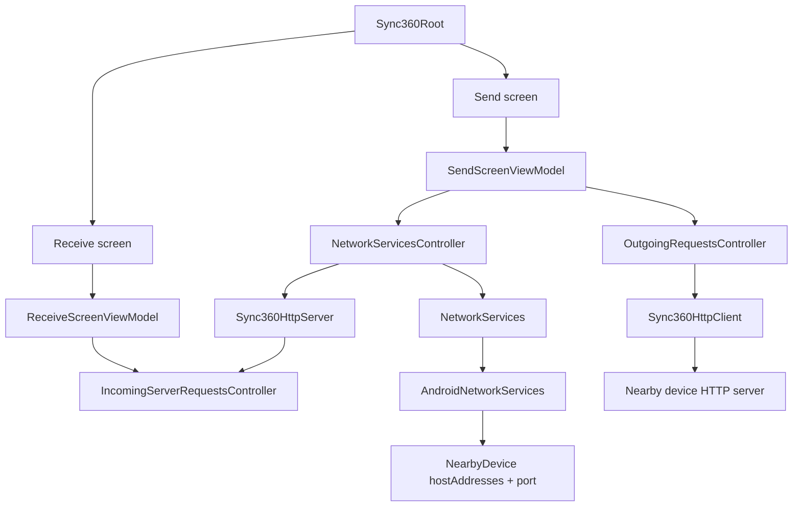

# Architecture

Sync360 is being rebuilt as an Android-first Kotlin Multiplatform app for local network sharing.

The current architecture is intentionally small. It is not trying to be a perfect final system yet. The priority is understanding the real flow: discovery, route resolution, local HTTP request/response, UI state, and receiver decisions.

## Current high-level flow

```text
Android app starts
  -> Koin creates long-lived services/controllers
  -> SendScreenViewModel starts network services
  -> NetworkServicesController starts local Ktor server
  -> server returns its dynamic port
  -> Android NSD advertises device with that port
  -> other devices discover hostAddresses + port
  -> Ktor client calls /sync360/ping
  -> receiver UI accepts/declines
  -> server responds to sender
```

## Module layout

```text
androidApp/
  Android application entry point

desktopApp/
  JVM desktop shell; not active in rebuilt networking flow yet

shared/
  commonMain/
    shared Compose UI
    ViewModels
    domain models
    Koin common module
    Ktor client/server proof
    request coordination controllers

  androidMain/
    Android NSD implementation
    Android local device identity
    Android Koin bindings
```

## Current main components

### `Sync360Root`

Shared Compose root. It owns the main scaffold, Navigation 3 display, Send/Receive destinations, and current navigation reaction to incoming request state.

### `SendScreenViewModel`

UI-facing state holder for the Send screen.

Currently exposes:

- nearby devices
- discovery status
- experimental send request status
- reload action
- outgoing ping action

It should not become the HTTP client or server. It should call lower-level controllers.

### `ReceiveScreenViewModel`

UI-facing state holder for the Receive screen.

Currently exposes:

- incoming server request state
- Accept/Decline decision action

### `NetworkServicesController`

Coordinates network startup order.

Current job:

1. Start `Sync360HttpServer`.
2. Read the dynamic HTTP server port.
3. Start `NetworkServices` with that port.
4. Keep discovery scanning for a short window.
5. Stop discovery scan.

This exists because discovery needs a port, but discovery should not need to know how to start the HTTP server.

### `NetworkServices`

Common discovery contract.

Current Android implementation: `AndroidNetworkServices`.

It exposes:

- `nearbyDevices: StateFlow<List<NearbyDevice>>`
- `discoveryServiceStatus: StateFlow<DiscoveryStatus>`
- start/restart/stop discovery operations

### `AndroidNetworkServices`

Android NSD implementation.

Current job:

- advertise this device through Android `NsdManager`
- discover `_sync360._tcp.` services
- resolve services
- map Android `NsdServiceInfo` into common `NearbyDevice`
- filter out this device by UUID

### `Sync360HttpServer`

Embedded Ktor CIO server.

Current route:

```text
GET /sync360/ping
```

It starts on port `0`, meaning the OS chooses a free port. That assigned port is advertised through NSD.

### `Sync360HttpClient`

Ktor CIO client for outgoing local requests.

Currently sends ping requests to discovered devices using:

```text
http://{host}:{port}/sync360/ping
```

### `IncomingServerRequestsController`

Bridge between server routes and Receive UI.

Pattern:

```text
server route receives request
  -> sets ServerState.Busy
  -> waits for CompletableDeferred<UserDecision>
  -> Receive UI completes decision
  -> server route resumes and responds
```

### `OutgoingRequestsController`

Small wrapper around outgoing HTTP client calls. It converts lower-level failures into route-specific response objects for UI-facing code.

## Current data models

Important models:

- `NearbyDevice`
- `DiscoveryStatus`
- `ServerState`
- `RequestType`
- `UserDecision`
- `PingRequestResponse`
- `PingResponse`

The project currently prefers route-specific DTOs over generic polymorphic wrappers. This avoids unclear JSON shapes while the protocol is still being learned and designed.

## Current architecture diagram



## What is intentionally not final

- Naming is still evolving.
- Ping currently exercises Accept/Decline, but real offer routes should own that flow later.
- Discovery and server lifecycle are still simple.
- No timeout exists for pending user decisions yet.
- No final file transfer architecture exists in the rebuilt flow yet.
- No security layer exists yet.

## Direction

The intended direction is:

```text
Screen -> ViewModel -> controller/service -> data/platform implementation
```

Rules of thumb:

- Screens render state and call ViewModel functions.
- ViewModels expose UI state and launch UI actions.
- Controllers coordinate flows across multiple services.
- Data/remote classes own Ktor work.
- Android data classes own Android APIs.
- Domain models describe shared app concepts.
